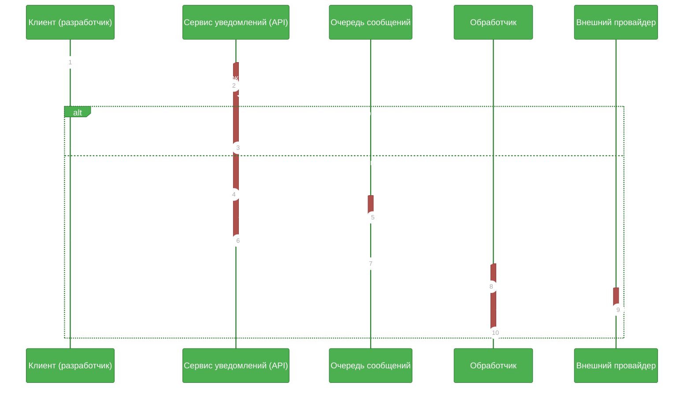

```mermaid
%%{init: {'theme': 'base', 'themeVariables': { 'primaryColor': '#4CAF50', 'primaryTextColor': '#fff', 'primaryBorderColor': '#2E7D32', 'lineColor': '#555', 'fontSize': '16px', 'fontFamily': 'Arial, sans-serif'}}}%%
sequenceDiagram
    participant Client as Клиент (разработчик)
    participant API as Сервис уведомлений (API)
    participant Queue as Очередь сообщений
    participant Worker as Обработчик
    participant Provider as Внешний провайдер

    autonumber
    Client->>API: POST /send/email (запрос)
    activate API
    API->>API: Проверка токена и данных
    alt Данные некорректны
        API-->>Client: Ошибка 400 (Некорректный запрос)
    else Данные корректны
        API->>Queue: Добавить задачу
        activate Queue
        Queue-->>API: Подтверждение (ID задачи)
        deactivate Queue
        API-->>Client: 200 OK (ID задачи, статус "queued")
        deactivate API
        Queue->>Worker: Взять задачу из очереди
        activate Worker
        Worker->>Provider: Отправить уведомление
        activate Provider
        Provider-->>Worker: Статус доставки
        deactivate Provider
        Worker-->>Queue: Обновить статус задачи
        deactivate Worker
    end
```