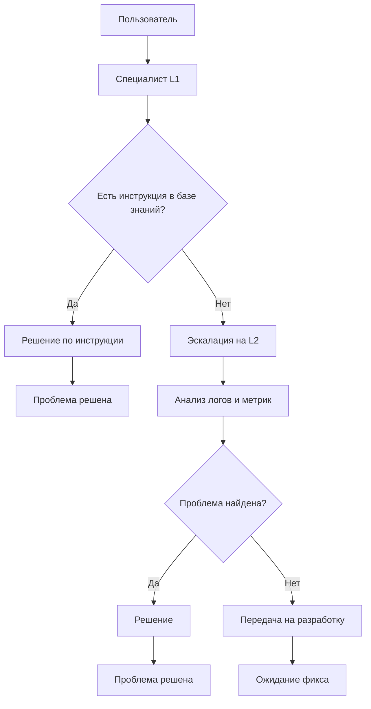

На схеме представлен процесс обработки запроса в службе поддержки. Если решение есть в базе знаний — оно применяется сразу. Если нет — запрос эскалируется на второй уровень для углубленной диагностики.

